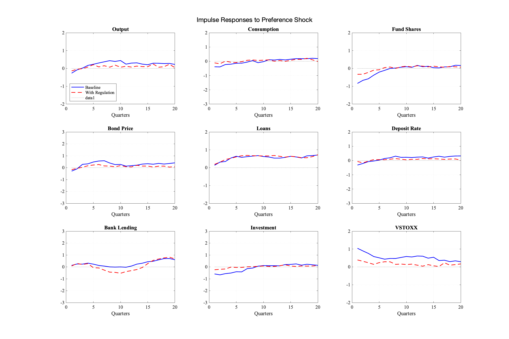

# DSGE Model with Investment Funds and Macroprudential Regulation

[](https://choosealicense.com/licenses/mit/)

A MATLAB implementation of the DSGE (Dynamic Stochastic General Equilibrium) model with investment funds and macroprudential regulation, based on the ECB Working Paper No. 2695.

## Author

- **Chen Xingqiang**
- GitHub: [@chenxingqiang](https://github.com/chenxingqiang)
- Email: <chen.xingqiang@iechor.com>

## Project Structure

```
project/
├── src/                    # Source code
│   ├── models/            # Model implementations
│   ├── calibration/       # Model calibration
│   └── analysis/          # Analysis tools
├── lib/                   # Utility functions
├── tests/                 # Test suites
├── results/               # Results and figures
└── doc/                   # Documentation
```

## Key Features

- VAR model analysis of fund outflows' macroeconomic impact
- DSGE model with:
  - Household sector with deposit preferences
  - Banking sector
  - Investment fund sector with liquidity risk
  - Production sector
- Welfare analysis of macroprudential regulation
- Policy analysis and shock response evaluation

## Key Results

### 1. VAR Analysis


---


The VAR analysis shows that investment fund outflows have significant macroeconomic effects. A 1% outflow shock leads to:

- 0.4% reduction in industrial production
- Persistent effects on bank lending
- Significant increases in corporate bond spreads

### 2. Optimal Regulation


The optimal liquidity requirement is found to be 7.2% of assets under management. This result balances:

- Benefits from reduced resource losses
- Costs from reduced household deposits
- Changes in financial intermediation

### 3. Welfare Decomposition


The welfare effects can be decomposed into:

- Resource gains from lower bond sales
- Utility losses from reduced household deposits
- Effects from changes in financial intermediation

### 4. Policy Effects


The liquidity regulation effectively stabilizes the economy under preference shocks by:

- Reducing forced bond sales
- Maintaining financial intermediation
- Stabilizing consumption and output

## Installation

1. Clone the repository:

```bash
git clone https://github.com/chenxingqiang/dsge-investment-funds.git
```

2. Open MATLAB and add the project to your path:

```matlab
addpath(genpath('dsge-investment-funds'))
```

3. Run the main analysis:

```matlab
main
```

## Usage

### Basic Model Simulation

```matlab
params = ModelParameters();
model = DSGEModel(params);
[ss, success] = model.compute_steady_state();
```

### Policy Analysis

```matlab
policy_analyzer = PolicyAnalysis(model);
[opt_policy, results] = policy_analyzer.find_optimal_policy();
```

### Shock Analysis

```matlab
shock_results = policy_analyzer.analyze_aggregate_shock('preference', opt_policy);
```

## Testing

Run all tests:

```matlab
runtests('tests')
```

## Contributing

1. Fork the repository
2. Create your feature branch
3. Commit your changes
4. Push to the branch
5. Open a Pull Request

## License

This project is licensed under the MIT License - see the [LICENSE](LICENSE) file for details.

## Acknowledgments

Based on the ECB Working Paper No. 2695: "Macroprudential regulation of investment funds" by Giovanni di Iasio, Christoph Kaufmann, and Florian Wicknig.

## Citation

If you use this code in your research, please cite:

```
@techreport{diIasio2022,
    title={Macroprudential regulation of investment funds},
    author={di Iasio, Giovanni and Kaufmann, Christoph and Wicknig, Florian},
    year={2022},
    institution={European Central Bank},
    number={2695}
}
```
